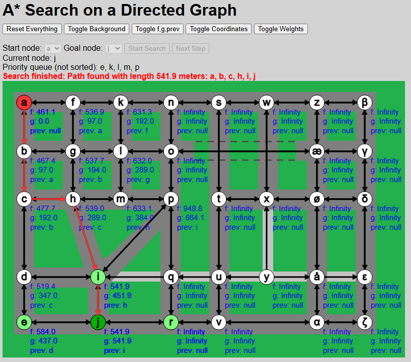

# A* Search on a Directed Graph

Dette eksamensprojekt omhandler A* search på en directed graph, som jeg illustrerer ved at tage udgangspunkt i vejnetværket for en by med både ensrettede og dobbeltrettede veje.

Gruppemedlemmer:
Peter Bollhorn

Link til deployet udgave:
https://pbollhorn.github.io/dsa-eksamen

